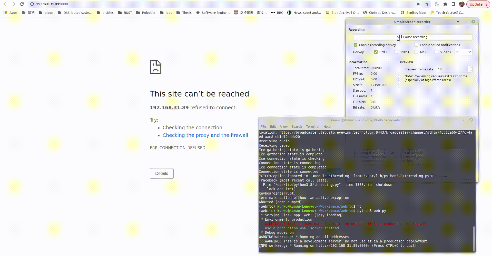

# Simple WebRTC Python Client


WebRTC is an evolving technology for peer-to-peer communication on the web. This repository demonstrates how this technology can be used to establish a peer connection from a Python instance. It connects to a public live stream and saves the video&audio as a mp4 file.


#### Table of Contents

-   [Installation](#Installation)
-   [Usage](#Usage)
-   [Example](#Example)
-   [Issues](#Issues)
-   [To Do](#To-do)

## Installation

We recommend using [Conda or (Miniconda)](https://conda.io/projects/conda/en/latest/user-guide/install/index.html#installing-conda-on-a-system-that-has-other-python-installations-or-packages) to manage the packages and versions of this WebRTC Python Client. You are free to choose your version manager of choice (eg. pyenv or plain pip), in that case have a look at [environment.yml](./environment.yml) to see what packages you need to install. Below are the installation instructions using Miniconda.

```bash
git clone https://github.com/kunwu/webrtc_client.git
cd webrtc_client
conda env create -f environment.yml
conda activate webrtc
```

## Usage

This client works out of the box with the google signaling server. By default, it connects to the live stream provided by Eyevinn.

```bash
python3 web.py [--url]
```

## Example



## Issues

When connecting from campus network, only audio is recorded. However, both video and audio could be accessed when running at home (a different network environment).

## To-do

1. Understand the difference of network environments.

2. Try object detections for fun.